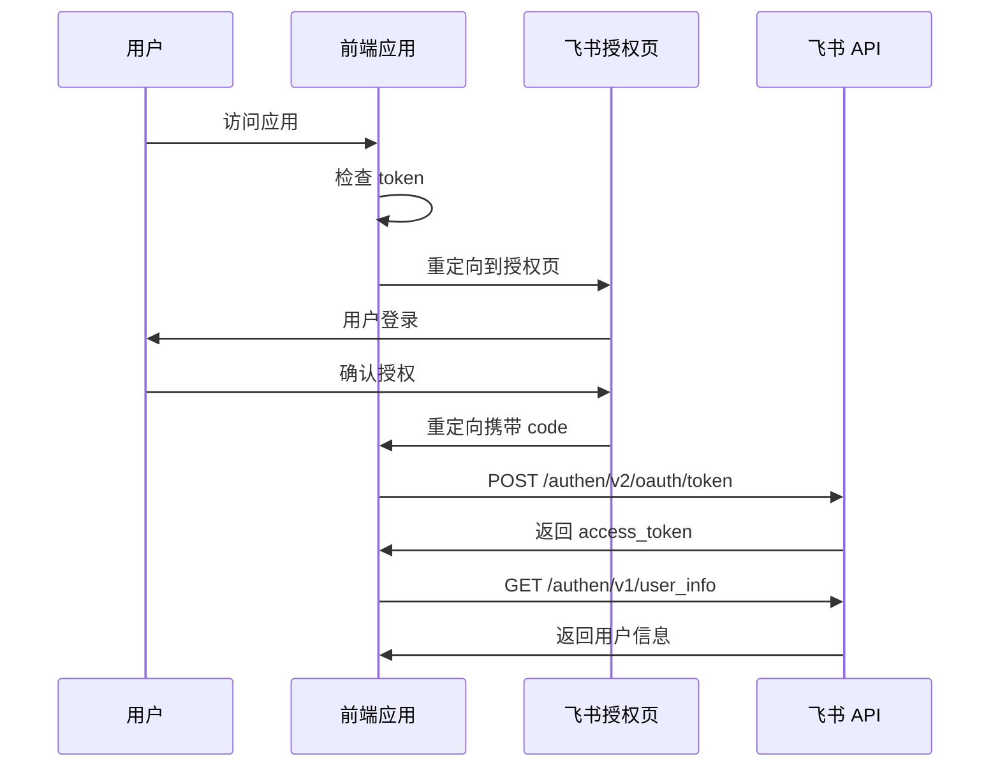

# Feishu API Contracts

## Overview

本文档定义了应用与飞书 API 的所有接口契约。

## Authorization Flow



## API Endpoints

### 1. OAuth Authorization

**Endpoint**: `GET https://accounts.feishu.cn/open-apis/authen/v1/authorize`

**Query Parameters**:

| Parameter | Type | Required | Description |
|-----------|------|----------|-------------|
| client_id | string | Yes | 应用 ID: `cli_a9f2a57b5338dcbb` |
| response_type | string | Yes | 固定值: `code` |
| redirect_uri | string | Yes | URL 编码的重定向地址 |
| scope | string | Yes | 权限范围 |
| state | string | No | CSRF 防护字符串 |

**Response**: 重定向到 redirect_uri，URL 包含 `code` 和 `state` 参数

---

### 2. Get Access Token

**Endpoint**: `POST https://open.feishu.cn/open-apis/authen/v2/oauth/token`

**Headers**:
- `Content-Type: application/json; charset=utf-8`

**Request Body**:

```json
{
  "grant_type": "authorization_code",
  "client_id": "cli_a9f2a57b5338dcbb",
  "client_secret": "xy3hn1WUb1YQ72G5NrqrEhyfxFPLsuI1",
  "code": "{授权码}",
  "redirect_uri": "{回调地址}",
  "scope": "contact:user.employee_id:readonly contact:user.base:readonly directory:employee.base.avatar:read offline_access"
}
```

**Response (200)**:

```json
{
  "code": 0,
  "access_token": "eyJhbGciOiJFUzI1NiIs...",
  "expires_in": 7200,
  "refresh_token": "eyJhbGciOiJFUzI1NiIs...",
  "refresh_token_expires_in": 604800,
  "scope": "contact:user.employee_id:readonly ...",
  "token_type": "Bearer"
}
```

**Error Response (non-zero code)**:

```json
{
  "code": 9999,
  "msg": "error message"
}
```

---

### 3. Refresh Token

**Endpoint**: `POST https://open.feishu.cn/open-apis/authen/v2/oauth/token`

**Headers**:
- `Content-Type: application/json; charset=utf-8`

**Request Body**:

```json
{
  "grant_type": "refresh_token",
  "client_id": "cli_a9f2a57b5338dcbb",
  "client_secret": "xy3hn1WUb1YQ72G5NrqrEhyfxFPLsuI1",
  "refresh_token": "{refresh_token}"
}
```

**Response**: 同获取 token 接口

---

### 4. Get User Info

**Endpoint**: `GET https://open.feishu.cn/open-apis/authen/v1/user_info`

**Headers**:
- `Authorization: Bearer {access_token}`
- `Content-Type: application/json; charset=utf-8`

**Response (200)**:

```json
{
  "code": 0,
  "msg": "success",
  "data": {
    "name": "用户名",
    "avatar_url": "https://example.com/avatar.jpg",
    "user_id": "80007273"
  }
}
```

---

### 5. Search Task Records (Bitable)

**Endpoint**: `POST https://open.feishu.cn/open-apis/bitable/v1/apps/{app_token}/tables/{table_id}/records/search`

**Headers**:
- `Authorization: Bearer {access_token}`
- `Content-Type: application/json; charset=utf-8`

**Path Parameters**:

| Parameter | Value |
|-----------|-------|
| app_token | `F8fVbiNk5anBFCsjeazcap1dnAg` |
| table_id | `tbl0PbpUS5H3dhil` (服务保障) 或 `tblScQ1wC10F9Gts` (生产保障) |

**Query Parameters**:
- `user_id_type=user_id`
- `page_size=500`

**Request Body**:

```json
{
  "filter": {
    "conjunction": "and",
    "conditions": [
      {
        "value": ["80007273"],
        "operator": "is",
        "field_name": "工号"
      }
    ]
  }
}
```

**Response (200)**:

```json
{
  "code": 0,
  "data": {
    "has_more": false,
    "items": [
      {
        "record_id": "recv9A66HE3HZY",
        "fields": {
          "总分": { "type": 2, "value": [0] },
          "被评议主体": [
            {
              "id": "80002829",
              "name": "魏晓辉",
              "avatar_url": "https://example.com/avatar.jpg",
              "email": ""
            }
          ],
          "评议人": [
            {
              "id": "80007273",
              "name": "孔鸣",
              "avatar_url": "https://example.com/avatar.jpg"
            }
          ]
        }
      }
    ],
    "page_token": "cGFnZVRva2VuOjE=",
    "total": 5
  },
  "msg": "success"
}
```

---

### 6. Submit/Update Score (Bitable)

**Endpoint**: `PUT https://open.feishu.cn/open-apis/bitable/v1/apps/{app_token}/tables/{table_id}/records/{record_id}`

**Headers**:
- `Authorization: Bearer {access_token}`
- `Content-Type: application/json; charset=utf-8`

**Path Parameters**:

| Parameter | Value |
|-----------|-------|
| app_token | `F8fVbiNk5anBFCsjeazcap1dnAg` |
| table_id | `tbl0PbpUS5H3dhil` (服务保障) 或 `tblScQ1wC10F9Gts` (生产保障) |
| record_id | 任务 ID（即 task_id） |

**Query Parameters**:
- `user_id_type=user_id`

**Request Body**:

```json
{
  "fields": {
    "上年度总结": 15,
    "工作亮点": 4,
    "不足之处": 8,
    "明年工作计划": 12,
    "述职报告合格性": 4
  }
}
```

**Response (200)**:

```json
{
  "code": 0,
  "data": {
    "record": {
      "id": "recv9A66HE3HZY",
      "record_id": "recv9A66HE3HZY",
      "fields": {
        "上年度总结": 15,
        "工作亮点": 4,
        "不足之处": 8,
        "明年工作计划": 12,
        "述职报告合格性": 4
      }
    }
  },
  "msg": "success"
}
```

---

## Error Handling

### Common Error Codes

| Code | Message | Handling |
|------|---------|----------|
| 0 | success | 正常 |
| 9999 | system error | 重试或联系支持 |
| 4xx | request error | 检查参数 |
| 40101 | unauthorized | 刷新 token 或重新授权 |

### Retry Strategy

- **401 Unauthorized**: 自动刷新 token，重试 1 次
- **429 Too Many Requests**: 指数退避重试
- **5xx Server Error**: 重试 3 次，间隔 1s, 2s, 4s
