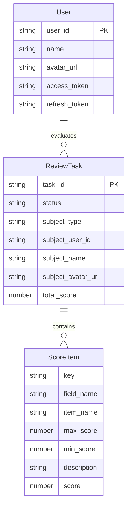
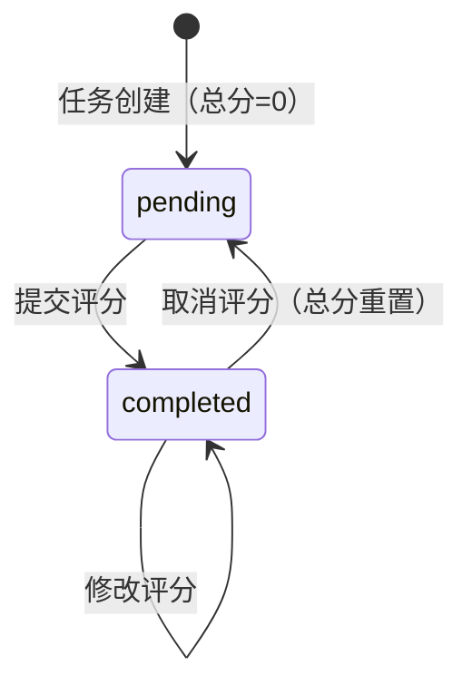

# Data Model: 干部述职评议表单

## Overview

本数据模型定义了干部述职评议表单应用中的核心数据类型，与飞书多维表格字段一一对应（前端英文 key 与飞书中文字段映射）。

## Entity Relationships



## Core Entities

### User

已授权的评议人信息。

| Field | Type | Required | Description |
|-------|------|----------|-------------|
| user_id | string | Yes | 飞书用户 ID |
| name | string | Yes | 用户姓名 |
| avatar_url | string | Yes | 用户头像 URL |
| access_token | string | Yes | 飞书访问令牌（内存存储） |
| refresh_token | string | Yes | 刷新令牌（localStorage 存储） |

### ReviewTask

评议任务，对应飞书多维表格的一条记录。

| Field | Type | Required | Description |
|-------|------|----------|-------------|
| task_id | string | Yes | 任务唯一标识（即 record_id） |
| status | 'pending' \| 'completed' | Yes | 评议状态 |
| subject_type | 'service_support' \| 'production_support' | Yes | 被评议主体类型 |
| subject_user_id | string | Yes | 被评议人 user_id |
| subject_name | string | Yes | 被评议人姓名 |
| subject_avatar_url | string | Yes | 被评议人头像 |
| total_score | number \| null | Yes | 总分，未评议时为 null |

### ScoreItem

评分项定义，与飞书多维表格字段映射。

| Field | Type | Required | Description |
|-------|------|----------|-------------|
| key | string | Yes | 前端英文 key |
| field_name | string | Yes | 飞书多维表格字段名 |
| item_name | string | Yes | 显示名称 |
| max_score | number | Yes | 最高分值 |
| min_score | number | Yes | 最低分值 |
| description | string | Yes | 评分标准描述 |
| score | number \| null | No | 当前评分，未评分为 null |

**评分项配置（常量）**:

| key | field_name | item_name | 分值范围 | 默认描述 |
|-----|------------|-----------|----------|----------|
| last_year_summary | 上年度总结 | 上年度总结 | 1-15 | 工作成果符合期望（11-15分）... |
| work_highlight | 工作亮点 | 工作亮点 | 1-5 | 工作成果超出预期程度（1-5分） |
| weakness | 不足之处 | 不足之处 | 1-10 | 总结全面，分析研究比较客观（8-10分）... |
| next_year_plan | 明年工作计划 | 明年工作计划 | 1-15 | 内容全面，目标明确，措施具体（11-15分）... |
| report_compliance | 述职报告合格性 | 述职报告合格性 | 1-5 | 报告内容（3分）+ 汇报时长（2分） |

### ReviewFormData

评议表单数据结构。

| Field | Type | Required | Description |
|-------|------|----------|-------------|
| task_id | string | Yes | 关联任务 ID |
| subject_user_id | string | Yes | 被评议人 ID |
| scores | Record<string, number> | Yes | 评分项分值映射（key -> score） |
| submitted_at | string | Yes | 提交时间 ISO 字符串 |

## State Machines

### ReviewTask Status



## API Response Types

### Task List Response

```typescript
interface FeishuTaskListResponse {
  code: number;
  data: {
    has_more: boolean;
    items: Array<{
      record_id: string;
      fields: {
        总分: { type: 2; value: number[] };
        被评议主体: Array<{
          id: string;
          name: string;
          avatar_url: string;
          email: string;
        }>;
        评议人?: Array<{
          id: string;
          name: string;
        }>;
      };
    }>;
    page_token: string;
    total: number;
  };
  msg: string;
}
```

### Submit Score Response

```typescript
interface FeishuSubmitResponse {
  code: number;
  data: {
    record: {
      id: string;
      record_id: string;
      fields: Record<string, any>;
    };
  };
  msg: string;
}
```

## Utility Types

### Score Calculation

```typescript
type ScoreRecord = Record<string, number>;

function calculateTotalScore(scores: ScoreRecord): number {
  return Object.values(scores).reduce((sum, score) => sum + score, 0);
}
```

### Field Mapping

```typescript
const SCORE_FIELD_MAP: Record<string, string> = {
  last_year_summary: '上年度总结',
  work_highlight: '工作亮点',
  weakness: '不足之处',
  next_year_plan: '明年工作计划',
  report_compliance: '述职报告合格性',
};
```
